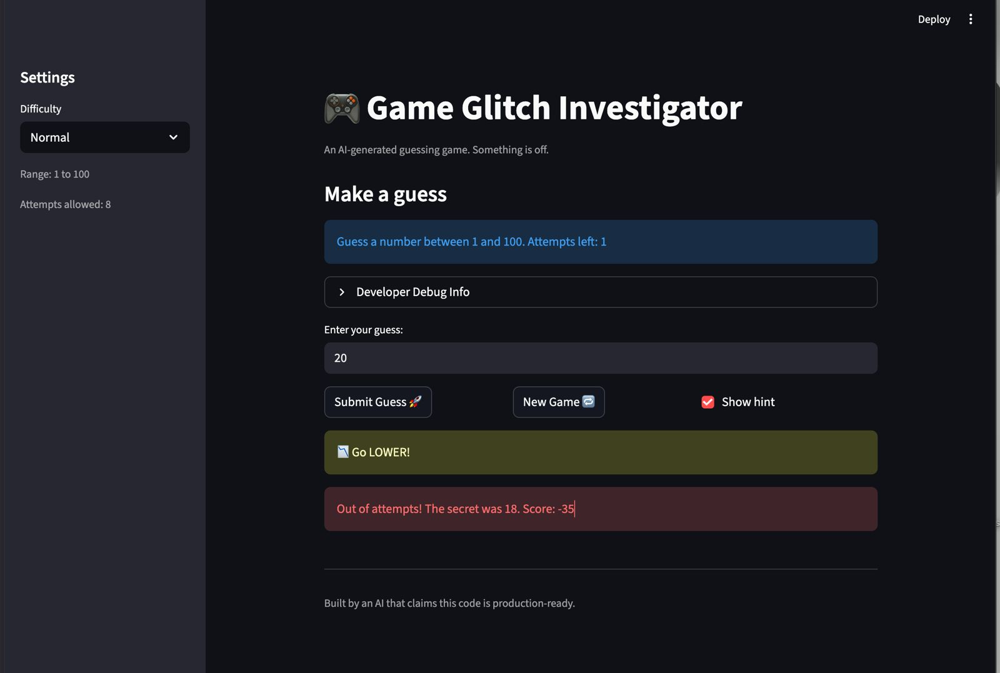

# 🎮 Game Glitch Investigator: The Impossible Guesser

## 🚨 The Situation

You asked an AI to build a simple "Number Guessing Game" using Streamlit.
It wrote the code, ran away, and now the game is unplayable.

- You can't win.
- The hints lie to you.
- The secret number seems to have commitment issues.

## 🛠️ Setup

1. Install dependencies: `pip install -r requirements.txt`
2. Run the broken app: `python -m streamlit run app.py`

## 🕵️‍♂️ Your Mission

1. **Play the game.** Open the "Developer Debug Info" tab in the app to see the secret number. Try to win.
2. **Find the State Bug.** Why does the secret number change every time you click "Submit"? Ask ChatGPT: *"How do I keep a variable from resetting in Streamlit when I click a button?"*
3. **Fix the Logic.** The hints ("Higher/Lower") are wrong. Fix them.
4. **Refactor & Test.**
   - Move the logic into `logic_utils.py`.
   - Run `pytest` in your terminal.
   - Keep fixing until all tests pass!

## 📝 Document Your Experience

### Game Purpose
This is a number guessing game built with Streamlit. The player picks a difficulty, and the game generates a secret number within that range. The player guesses numbers and receives hints ("Too High" / "Too Low") until they either guess correctly or run out of attempts.

### Bugs Found
1. **Hints were reversed** — When the guess was too high, the game said "Go HIGHER!" and when too low, it said "Go LOWER!" This made the game impossible to win by following the hints.
2. **Info text was hardcoded** — The game always displayed "Guess a number between 1 and 100" regardless of the difficulty setting, which was confusing when playing on Easy or Hard mode.
3. **Hard mode was easier than Normal** — The difficulty ranges were wrong. Hard mode used 1–50 while Normal used 1–100, making Hard actually easier.

### Fixes Applied
- Swapped the hint messages in `check_guess()` so "Too High" shows "Go LOWER!" and "Too Low" shows "Go HIGHER!"
- Updated the info text to use the actual `low` and `high` values from `get_range_for_difficulty()`
- Changed Hard mode range to 1–200 so it's genuinely harder
- Refactored all game logic functions from `app.py` into `logic_utils.py`
- Fixed the New Game button to use the correct difficulty range instead of hardcoded 1–100
- Removed the string conversion bug that caused unreliable comparisons on even attempts

## 📸 Demo

